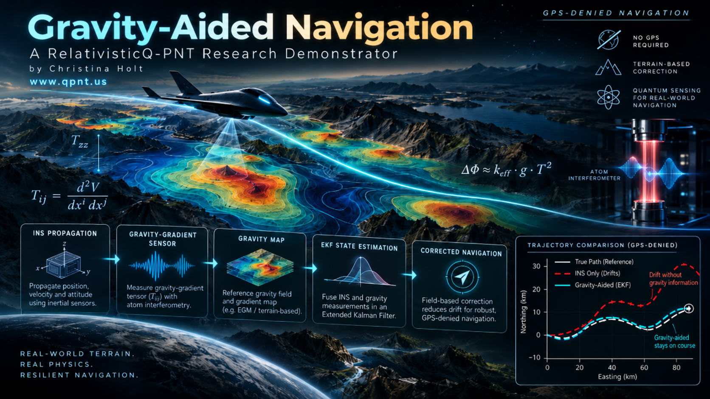

# Gravity-Aided Navigation / Assured PNT Trade Study Suite

**A RelativisticQ-PNT research and engineering demonstrator**



[](https://github.com/wtfchristina/gravity-aided-navigation/actions/workflows/ci.yml)

This repository is a configuration-driven Assured PNT simulation and trade-study suite for evaluating environmental map-aided navigation during GNSS outages. Version 0.5 adds a software/hardware-in-the-loop integration layer with timestamped sensor packets, JSONL record/replay, UDP transport, link-impairment simulation, stale-data rejection, and estimator-gateway traces.

> **Scope:** All results in this repository are synthetic simulations. They are not flight-test results, certified navigation performance, validated geophysical products, or claims of operational quantum-sensor capability.

## Why this project?

An unaided inertial navigation system accumulates error. Environmental fields such as gravity and magnetic anomalies can provide passive external observations that do not depend on GNSS.

The engineering question is not only whether those fields can be measured. It is:

> **Under what sensor, map, trajectory, and estimator conditions do environmental observations materially reduce navigation drift?**

Version 0.5 supports that question from both the analysis side and the integration side: reproducible scenario execution, Monte Carlo campaigns, requirements analysis, observability studies, and live/replayed sensor interfaces.


## v0.5 SIL/HIL integration capabilities

Version 0.5 moves the suite beyond offline trade studies toward integration testing. The new transport layer intentionally uses a simple, documented JSON packet schema so simulators, embedded targets, sensor emulators, and other languages can connect without importing the Python estimator package.

### Timestamped sensor packets

The shared packet schema carries sensor time, sequence number, frame, values, and metadata. Supported demonstration packet types include IMU, gravity, magnetic, and truth-reference scoring packets. Truth-reference data is explicitly excluded from navigation inputs.

### JSONL record and replay

Generate or ingest repeatable sensor logs for debugging and regression tests:

```bash
qpnt generate-log configs/fixed_wing_fused.yaml --out examples/data/sample_sensor_log.jsonl
qpnt replay configs/fixed_wing_fused.yaml examples/data/sample_sensor_log.jsonl --speed 0
```

Use `--speed 1` for real-time replay or a larger number for accelerated playback.

### UDP streaming gateway

Publish the synthetic sensor stream over UDP:

```bash
qpnt udp-publish configs/fixed_wing_fused.yaml --host 127.0.0.1 --port 5555 --speed 10
```

Record incoming packets from another process, simulator, or lab device:

```bash
qpnt udp-record --host 127.0.0.1 --port 5555 --seconds 30 --out results/udp_capture.jsonl
```

### Link-impairment testing

The SIL/HIL harness can inject deterministic latency, jitter, and packet loss before the estimator gateway receives sensor data:

```bash
qpnt hil-demo configs/fixed_wing_fused.yaml \
  --latency-ms 30 \
  --jitter-ms 8 \
  --dropout 0.02 \
  --out results/hil_demo
```

Outputs include delivery percentage, mean/p95 link latency, stale-packet rejection counts, accepted environmental updates, navigation error, and a packet-level integration trace.

### Estimator gateway

`NavigationGateway` decouples the fusion engine from transport. It accepts `SensorPacket` objects regardless of whether they came from a simulation, file replay, UDP socket, or future hardware adapter. This is the intended extension point for customer-specific interfaces.

> The v0.5 UDP and replay tools are engineering integration interfaces, not certified avionics data buses or safety-critical transport implementations.

## v0.4 mission-requirements capabilities

### Mission requirements solver

Specify terminal-error, RMSE, success-probability, and alert-limit targets, then sweep sensor noise and update rates to identify modeled configurations that satisfy the requirement.

```bash
qpnt requirements configs/mission_requirement.yaml --runs 25
```

### Integrity-analysis research layer

Generate a causal protection-level proxy, alert-limit trace, empirical availability, and an HMI-like proxy event rate. These are deliberately labeled as **research proxies**, not certified navigation-integrity metrics.

```bash
qpnt integrity configs/fixed_wing_fused.yaml --runs 25 --alert-limit-m 300
```

### Mission-envelope analysis

Evaluate whether a modeled sensor suite can satisfy the same requirement across changing GNSS-outage duration and vehicle speed.

```bash
qpnt mission-envelope configs/mission_requirement.yaml --runs 10
```

### Requirements-driven decision support

Version 0.4 shifts the project from "which configuration performs best?" toward a buyer-facing engineering question:

> **What sensor performance and update rate are required to meet a defined navigation target for a specified mission?**


### Multi-modal environmental navigation

Run the same deterministic IMU realization under four modes:

- INS only
- gravity-map aiding
- magnetic-map aiding
- fused gravity + magnetic aiding

This makes architecture comparisons fair and reproducible.

### Pluggable field observations

The fusion layer accepts any scalar map implementing:

```python
value(x, y)
gradient(x, y)
```

That lets users swap synthetic fields for customer or public map products without rewriting the estimator.

### External map ingestion

`GridFieldMap` supports regular-grid:

- CSV (`x_m,y_m,value`)
- NPZ (`x`, `y`, `value` arrays)

An example dataset is included in `examples/data/`.

### Monte Carlo campaigns

Evaluate distributions rather than one favorable trajectory:

- terminal error median
- terminal error 95th percentile
- RMSE median / p95
- estimator divergence rate
- aiding-mode comparisons

### Sensor trade-space analysis

Sweep:

- gravity measurement noise
- magnetic measurement noise
- environmental update rate
- random seed / IMU realization

and rank configurations by navigation performance.

### Observability analysis

The suite computes a local information proxy based on field gradients and sensor noise:

```text
information ~ ||grad h(x,y)||^2 / sigma^2
```

Gravity and magnetic information can be combined to identify where the environment is more or less informative for map-relative navigation.

### Automated reports

Scenario runs generate:

- CSV time histories
- JSON metrics
- Markdown engineering summaries
- dependency-free HTML reports

### Configuration-driven CLI

```bash
qpnt run configs/fixed_wing_fused.yaml
qpnt monte-carlo configs/fixed_wing_fused.yaml --runs 50
qpnt trade-study configs/fixed_wing_fused.yaml
```

This supports interactive use, batch studies, CI, and later integration into automated engineering workflows.

## Existing research modules

The repository also retains the earlier demonstrators:

### Gravity-gradient tensor model

A differentiable synthetic potential generates `Txx`, `Txy`, `Tyy`, and `Tzz` in Eotvos.

### Simplified cold-atom gradiometer

A differential phase model explores:

```text
DeltaPhi ~= k_eff * Gamma * L * T^2
```

with phase noise, vibration phase noise, update rate, and conversion back to a synthetic `Tzz` observation.

### Symplectic orbital benchmark

A planar Kepler benchmark compares RK4 with implicit-midpoint symplectic propagation and tracks long-horizon relative Hamiltonian error.

## Architecture

```text
                         GNSS unavailable
                               |
                               v
                          +---------+
                          |   IMU   |
                          +----+----+
                               |
                               v
                        INS propagation
                               |
               +---------------+---------------+
               |                               |
               v                               v
        Gravity observation             Magnetic observation
        map / cold-atom model           anomaly map
               |                               |
               +---------------+---------------+
                               |
                               v
                     gated environmental EKF
                               |
                               v
                     corrected navigation state
                               |
                 +-------------+-------------+
                 |                           |
                 v                           v
          Monte Carlo analysis        trade / observability
                 |                           |
                 +-------------+-------------+
                               |
                               v
                     engineering report
```

## Quick start

```bash
git clone https://github.com/wtfchristina/gravity-aided-navigation.git
cd gravity-aided-navigation
python -m venv .venv
source .venv/bin/activate   # Windows: .venv\Scripts\activate
pip install -e ".[dev]"
```

Run the new fused Assured PNT scenario:

```bash
qpnt run configs/fixed_wing_fused.yaml
```

Or:

```bash
python scripts/run_assured_pnt.py
```

Run a Monte Carlo campaign:

```bash
qpnt monte-carlo configs/fixed_wing_fused.yaml --runs 50
```

Run the default sensor trade study:

```bash
qpnt trade-study configs/fixed_wing_fused.yaml
```

Generate the analysis figures:

```bash
python scripts/generate_assured_pnt_figures.py
```

Run the interactive dashboard:

```bash
streamlit run app.py
```

Or with Docker:

```bash
docker compose up --build
```

Run tests:

```bash
pytest -q
```

## Configuration example

```yaml
scenario:
  duration_s: 600.0
  dt: 0.5
  speed_mps: 83.0
  mode: fused

  accel_noise_std: 0.03
  bias_rw_std: 0.0008

  gravity_noise_std: 2.0
  gravity_update_period_s: 2.0

  magnetic_noise_std_nt: 8.0
  magnetic_update_period_s: 1.0

  innovation_gate_sigma: 5.0
```

## Repository layout

```text
gravity-aided-navigation/
├── README.md
├── app.py
├── pyproject.toml
├── configs/
│   ├── fixed_wing_fused.yaml
│   ├── gravity_only.yaml
│   ├── magnetic_only.yaml
│   ├── mission_requirement.yaml
│   └── hil_demo.yaml
├── src/gravity_nav/
│   ├── assured_pnt.py
│   ├── fusion.py
│   ├── grid_map.py
│   ├── magnetic_map.py
│   ├── observability.py
│   ├── monte_carlo.py
│   ├── trade_study.py
│   ├── reporting.py
│   ├── requirements.py
│   ├── integrity.py
│   ├── mission.py
│   ├── requirements_config.py
│   ├── packets.py
│   ├── streaming.py
│   ├── replay.py
│   ├── transport.py
│   ├── gateway.py
│   ├── hil.py
│   ├── config.py
│   ├── cli.py
│   ├── gravity_map.py
│   ├── gravity_tensor.py
│   ├── cold_atom.py
│   ├── ekf.py
│   ├── tensor_ekf.py
│   └── symplectic.py
├── scripts/
├── examples/data/
├── tests/
├── docs/
├── figures/
└── results/
```

## Current product-facing value

Version 0.5 is intentionally positioned between a research demonstrator and an engineering integration/decision-support tool. It can already support:

- environmental-navigation concept studies
- sensor sensitivity analysis
- update-rate tradeoffs
- architecture comparison
- Monte Carlo robustness analysis
- map observability visualization
- reproducible engineering reports
- customer-map prototyping through regular-grid ingestion
- timestamped sensor record/replay
- UDP-based simulator/lab integration
- latency, jitter, dropout, and stale-data sensitivity testing
- packet-level estimator integration traces

See [`docs/productization.md`](docs/productization.md) and [`docs/commercial_overview.md`](docs/commercial_overview.md) for the proposed **Core / Analyst / Integrator** product path. Before publishing proprietary extensions, also review the [`licensing strategy note`](docs/licensing_strategy.md).

## Important limitations before operational use

A commercial or operational release would still require substantial additional engineering, including:

- full 6-DOF Earth-referenced strapdown navigation
- gyro/attitude error-state modeling
- Earth rotation and transport-rate terms
- validated gravity and magnetic data products
- validated clock synchronization and time-transfer models
- integrity monitoring and fault detection
- production-grade hardware adapters and certified avionics bus interfaces
- embedded target benchmarking
- formal requirements, V&V, traceability, and safety assurance
- customer support, secure update, licensing, and data-handling infrastructure

## Original reproducible demonstrations

The earlier baseline modules remain available through:

```bash
python scripts/run_simulation.py
python scripts/run_quantum_simulation.py
python scripts/run_symplectic_benchmark.py
```

## Responsible use

This project is intended for research, engineering trade studies, education, and software-method exploration. It is not certified for safety-critical or operational navigation.

## Author

**Christina Holt**  
RelativisticQ-PNT  
GitHub: [@wtfchristina](https://github.com/wtfchristina)
Website: [www.qpnt.us](https://www.qpnt.us)

## License

MIT License. See `LICENSE`.
